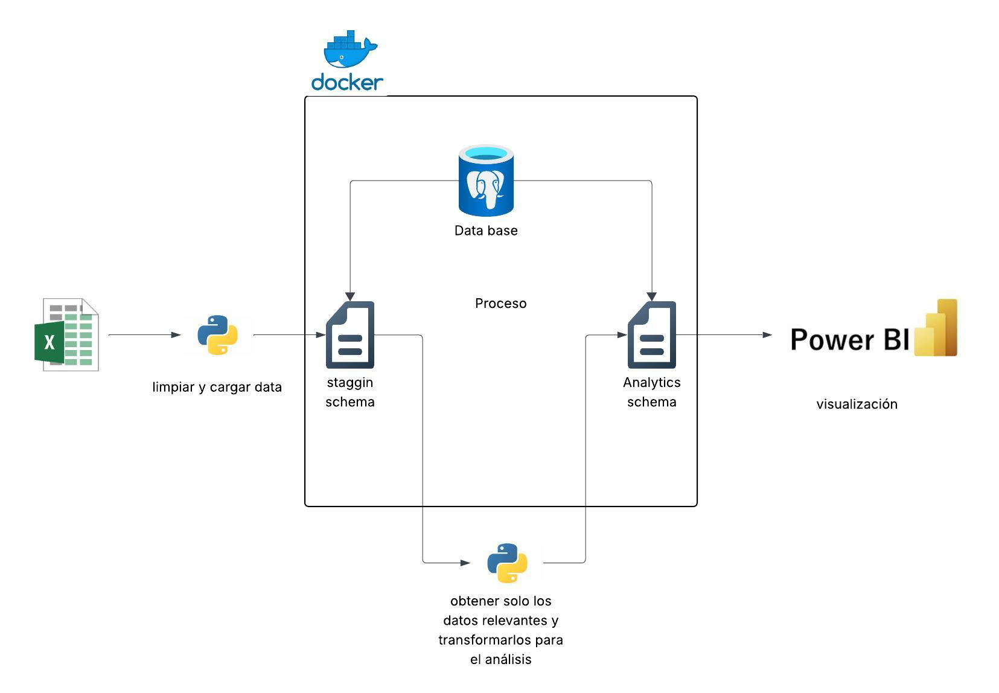

# Documentación del Proceso ETL

## Descripción General

Este proyecto implementa un proceso ETL (Extract, Transform, Load) completo para transformar datos desde archivos Excel hasta visualizaciones en Power BI, utilizando PostgreSQL como base de datos y Python para la orquestación del proceso.

## Arquitectura del Sistema
```
Excel → Python → Staging Schema → Analytics Schema → Power BI
```



## Fases del Proceso ETL

### 1. Análisis Inicial de Datos

**Fuente**: Archivo Excel

**Actividades**:
- Análisis exploratorio de los datos del archivo Excel
- Identificación de campos relevantes
- Evaluación de la calidad de los datos
- Diseño del modelo dimensional (esquema de copo de nieve)

### 2. Extracción y Carga a Staging

**Herramienta**: Python

**Proceso**:
- Extracción de datos desde el archivo Excel
- Limpieza básica de datos:
  - Eliminación de campos `undefined`
  - Reemplazo de valores nulos con `N/A`
  - Normalización de texto (uppercase → lowercase)
  - Estandarización de formatos
- Carga de datos al schema de staging en PostgreSQL

**Schema**: `staging_schema` (PostgreSQL)

### 3. Transformación y Carga al Schema Analítico

**Proceso**:
- Ejecución de consultas SQL para limpieza avanzada
- Transformación de datos según el modelo dimensional
- Extracción de datos relevantes para análisis
- Carga al schema analítico siguiendo el modelo de copo de nieve:
  1. Tablas dimensionales externas (más granulares)
  2. Tablas dimensionales intermedias
  3. Tabla de hechos (con todas las relaciones FK)

**Schema**: `analytics_schema` (PostgreSQL)

**Modelo**: Esquema de copo de nieve (Snowflake Schema)

### 4. Visualización

**Herramienta**: Power BI

**Proceso**:
- Conexión directa al schema analítico en PostgreSQL
- Creación de relaciones entre tablas
- Desarrollo de dashboards y visualizaciones
- Generación de reportes analíticos

## Tecnologías Utilizadas

- **Python**: Orquestación del ETL, limpieza y transformación de datos
- **PostgreSQL**: Base de datos relacional (schemas: staging y analytics)
- **Excel**: Fuente de datos inicial
- **Power BI**: Herramienta de visualización y análisis

## Esquema de Base de Datos

El proyecto utiliza un **modelo de copo de nieve** (Snowflake Schema) que consiste en:

- **Tabla de Hechos**: Contiene las métricas y claves foráneas a las dimensiones
- **Tablas Dimensionales**: Normalizadas en múltiples niveles para reducir redundancia

## Estructura del Proyecto
```
project/
│
├── data/                          # Datos de origen
│   └── source_data.xlsx          # Archivo Excel con datos iniciales
│
├── documentation/                 # Documentación del proyecto
│   ├── ETL.md                    # Esta documentación
│   └── resources/                # Recursos multimedia
│       └── ETL.jpeg              # Diagrama del proceso ETL
│
├── initdb/                        # Scripts de inicialización de base de datos
│   └── init.sql                  # Script SQL para crear schemas y tablas
│
├── venv/                          # Entorno virtual de Python (no versionado)
│
├── .gitignore                     # Archivos y carpetas ignorados por Git
├── docker-compose.yml             # Configuración de Docker para PostgreSQL
├── look-columns.py                # Script para análisis exploratorio de columnas
├── postgres-docker-project.code-workspace  # Workspace de VS Code
├── README.md                      # Documentación principal del proyecto
├── requirements.txt               # Dependencias de Python
└── script-cleaner.py              # Script principal del proceso ETL
```

## Ejecución del Proceso

1. **Preparación del entorno**:
```bash
   pip install pandas psycopg2 openpyxl sqlalchemy
```

2. **Configurar credenciales de base de datos**

3. **Ejecutar script de extracción y staging**:
```bash
   python scripts/extract_load.py
```

4. **Ejecutar script de transformación**:
```bash
   python scripts/transform.py
```

5. **Conectar Power BI al schema analytics** y crear visualizaciones

## Mejoras Futuras

- Automatización del proceso ETL con Apache Airflow
- Implementación de logs y monitoreo
- Validación de calidad de datos
- Creación de tests unitarios
- Documentación de transformaciones específicas

---
 
**Fecha**: Diciembre 2025  
**Versión**: 1.0